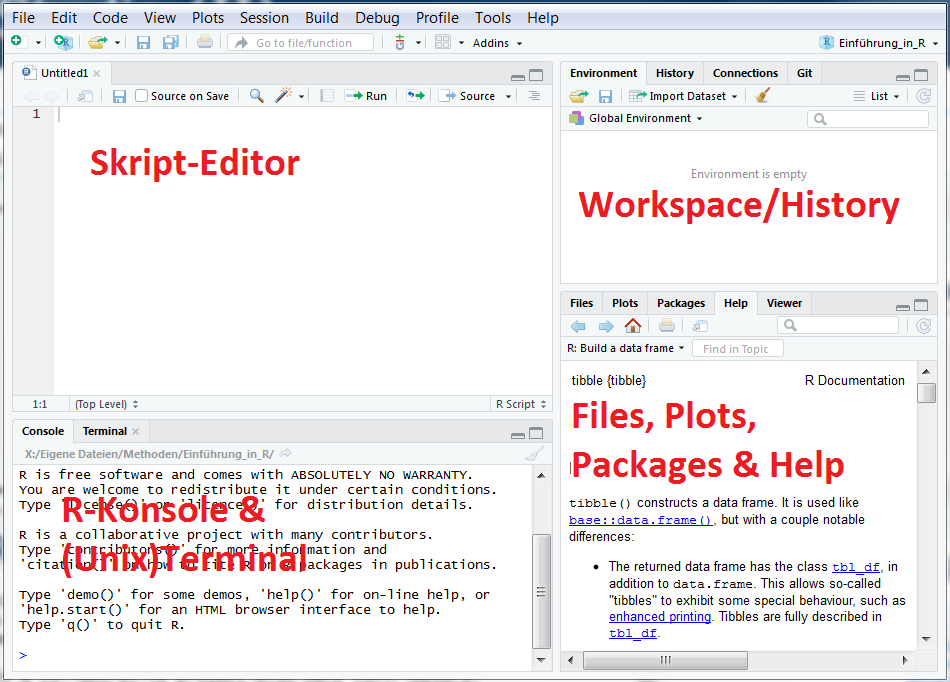

```{r setup, include=FALSE}
library(tidyverse)
library(kableExtra)
```


## Wer bin ich?

* Universitätsassistent am Institut für Angewandte Psychologie: Gesundheit, Entwicklung und Förderung der Fakultät für Psychologie an der Universität Wien

* Schwerpunkt Mess- und quantitative Methoden

* Workshops zu Mehrebenen-/Strukturgleichungsmodelle, R und MPlus

* nutze R seit 2009

* nutze tidyverse seit 2016

* bin tidyverse-Fan seit 2016

## Meine Fragen {.build}

Erfahrung mit R?

Erfahrung mit anderer Statistik-Software?

Erfahrung mit anderen Programmiersprachen?


## Inhalt {.build}

Grundlagen in R

Datenaufbereitung

Datenanalyse

Visualisierung

Best Practice / Workflow

## tidyverse 

Fokus liegt auf [**tidyverse**](https://www.tidyverse.org/){target="_blank"} da

* es R zugänglicher macht,

* den Workflow verbessert,

* R lesbarer und

* vergnüglicher macht


## Ablauf 

-------------------------------------------
               22.02.2019       28.03.2019
---------- ----------------- --------------
Vormittag   Allg. Einführung Visualisierung

Nachmittag Datenaufbereitung        Analyse
-------------------------------------------

# Allgemeine Einführung

# 1. Was ist R?

## Was ist R? {.smaller}

R ist eine Programmiersprache für __Datenmanipulation__, statistische Datenanalyse und grafische Darstellung von Daten

* Import und Export von Daten </br>(z.B. Trennzeichenbasierte Textdateien, Excel- oder SPSS-Dateien)

* Auswahl von Daten </br>(z.B. Auswahl/Ausschluss von Variablen und Fälle nach Kriterien)

* Transformation von Variablen </br>(z.B. Anwendung mathematischer Funktionen) 

* Umstrukturieren von Daten </br>(z.B. Umstrukturieren von wide format in long format)

* Manipulation von Zeichenketten </br>(z.B. Verknüpfen, Extrahieren oder Ersetzen von Zeichenketten)

## Was ist R? {.smaller}

R ist eine Programmiersprache für Datenmanipulation, __statistische Datenanalyse__ und grafische Darstellung von Daten

* Lineare/Nichtlineare Regression

* (Multivariate) Varianzanalyse (mit Messwiederholung)

* Strukturgleichungsmodellierung </br>(z.B. mit dem Paket `lavaan` oder `sem`)

* Mehrebenenanalyse </br>(z.B. mit dem Paket `lme4` oder `nlme`)

* Multiple Imputation </br>(z.B. mit dem Paket `mice`) 

* Ein- und mehrdimensionale Item-Response-Modelle </br>(z. B. mit dem Paket `TAM` oder `mirt`) 

* ...

## Was ist R? {.smaller}

R ist eine Programmiersprache für Datenmanipulation, statistische Datenanalyse und __grafische Darstellung von Daten__:

```{r, echo=FALSE, warning=FALSE, message=FALSE}
# create factors with value labels 
mtcars$gear <- factor(mtcars$gear,levels=c(3,4,5),
   labels=c("3gears","4gears","5gears")) 
mtcars$am <- factor(mtcars$am,levels=c(0,1),
   labels=c("Automatic","Manual")) 
mtcars$cyl <- factor(mtcars$cyl,levels=c(4,6,8),
   labels=c("4cyl","6cyl","8cyl")) 

# Kernel density plots for mpg
# grouped by number of gears (indicated by color)
p1 <- qplot(mpg, data=mtcars, geom="density", fill=gear, alpha=I(.5), 
   main="Distribution of Gas Milage", xlab="Miles Per Gallon", 
   ylab="Density")

# Scatterplot of mpg vs. hp for each combination of gears and cylinders
# in each facet, transmittion type is represented by shape and color
p2 <-qplot(hp, mpg, data=mtcars, shape=am, color=am, 
   facets=gear~cyl, size=I(3),
   xlab="Horsepower", ylab="Miles per Gallon") 

# Separate regressions of mpg on weight for each number of cylinders
p3 <- qplot(wt, mpg, data=mtcars, geom=c("point", "smooth"), 
   method="lm", formula=y~x, color=cyl, 
   main="Regression of MPG on Weight", 
   xlab="Weight", ylab="Miles per Gallon")

# Boxplots of mpg by number of gears 
# observations (points) are overlayed and jittered
p4 <- qplot(gear, mpg, data=mtcars, geom=c("boxplot", "jitter"), 
   fill=gear, main="Mileage by Gear Number",
   xlab="", ylab="Miles per Gallon")

gridExtra::grid.arrange(p1, p2, p3, p4, nrow = 2)
```


## Entwicklung von R 

---- -------------------------------------------------------------------------------------------------------------------------------------
1976 Entwicklung der Programmiersprache __S__ von Becker und Chambers in den _Bell Laboratories_ bei _AT&T_ (heute Alcatel-Lucent)

1992 Initiierung des _R-Projects_ durch Ross Ihaka und Robert Gentleman zur nicht-kommerzielle Implementierung von S

1997 Das _R Development Core Team_ (R Core Team), eine Gruppe von Personen zur fortlaufenden Entwicklung von R, vereinigt sich.

1998 Das _Comprehensive R Archive Network_ (CRAN), ein Netz von Servern zur Bereitstellung des Quellcodes und Binärdateien, wird gegründet

2000 Die erste zur Programmiersprache S kompatible Version, _R-1.0.0_, erschein

2019 Aktuelle Version: R-3.5.2 (Stand: Jän. 2019)
---- -------------------------------------------------------------------------------------------------------------------------------------
</br>
<font size="3">Der Name R entstand, da er (1) nahe an S liegt oder (2) **R**oss' und **R**obert's Vornamen mit R beginnen oder (3) man eine **r**educed version of S wollte.  </font>

## Vorteile von R {.build}

* <font size="4">Open Source-Software, die unter _GNU General Public License_ (GPL) lizensiert ist, d.h.</font>
    + <font size="4">Download und Installation des Programms ist kostenlos</font>
    + <font size="4">Gesamter Quellcode des Programms ist einsehbar</font>
    
* <font size="4">Erweiterbarkeit mit Hilfe von Paketen, d.h.</font>
    + <font size="4">Zugriff auf aktuelle Methoden, die in R programmiert wurden</font>
    + <font size="4">Möglichkeit, eigene Methoden über das Internet zu veröffentlichen</font>
    
* <font size="4">Schnittstelle für andere Programmiersprachen (z.B. Fortran, C, C++), und Datenbanken (z.B. MySQL)</font>

* <font size="4">Möglichkeit zum Aufruf anderer Programm aus R (z.B. Mplus) sowie Aufruf von R aus anderen Programmen (z.B. Microsoft Excel)</font>

* <font size="4">Große Anwender- bzw. Entwicklergemeinschaft, die Support anbietet (u.a. Mailinglisten, FAQ, frei zugängliche Literatur)</font>
 

## Nachteile von R {.build}

1. Einarbeitung in R erfordert Zeit, Übung und grundlegendes Verständnis für Programmierung

2. Als Interpretersprache in Extremsituationen, insbesondere bei ineffizienter Programmierung, langsam

3. Keine Garantie für die Korrektheit der Methoden in den veröffentlichten Paketen: „R ist freie Software und kommt _OHNE JEGLICHE GARANTIE_“

4. Schwer zu lesender Syntax

5. Keine einheitlicher Stil in den Paketen

</br>
4, 5 (+2): Tidyverse hilft hier

## Lernen von R {.build}

R ist eine **Programmiersprache** für Datenmanipulation, statistische Daten-analyse und grafische Darstellung von Daten

Wie beim Erlernen jeder andere Sprache, muss man sich mit dem Aufbau und Struktur dieser Sprache vertraut machen

Ähnlich dem Lernen von Vokabeln, müssen verschiedene Funktionen gelernt werde

Ganz wichtig: **Üben, üben, üben!**

# 2. R-Konsole, RStudio, Projekte und Rmarkdown

## R-Konsole {.smaller}

Einfachster Weg um R zu bedienen

Befehl wird unmittelbar ausgeführt

```{r}
2+2
```

Leerzeichen werden ignoriert

```{r}
2 + 2
```

Kommentarzeile nach # wird ignoriert

```{r}
#2 + 2
```

## Nützliche Tastenkürzel in der R-Konsole  {.build}

Mit _Esc_-Taste aktuelle Berechnung oder Eingabe abbrechen  

</br>

Mit Pfeiltasten rauf/runter die letzten Befehlszeilen aufrufen

</br>

Mit _Strg_ + _L_ die gesamte Konsole leeren


## RStudio {.build}

Für die Arbeit in R können Editoren verwendet werden, die das Erstellen längerer Skripts und die Dokumentation der Arbeitsschritte erleichtern:

z.B. [RStudio](https://www.rstudio.com){target="_blank"} für Windows, Mac OS X und Linux

* Open Source Software (kostenlos)

* Integrated development environment (IDE)
    + R-Konsole zum Ausführen der Befehle
    + Skript-Editor
    + Auflistung aller Objekte
    + Verknüpfung mit der internen Dokumentation
    + Plot-management tool
    + Syntax Highlighting


## RStudio



## Best Practice {.build}

Für neue "Projekte" auch tatsächlich ein RSudio Project verwenden (anlegen/öffnen/speichern).
Dadurch hat jeder Arbeitskontext seperate

* working directory
* workspace
* history
* source documents
* (version control)

`File >> New Project... >> New Directory >> New Project >> ...`

## Best Practice {.build}

Innerhalb des Projekts ist weitere Strukturierung mittels Ordner sinnvoll, zB.

`./source` für Original Datendateien

`./plots` für Grafiken

`./data` für aufbereitete Daten

`./scripts` für Skripte

`...`

## Notebooks {.build}

Im Projekt können neue Dateien, welche Befehle beinhalten, erstellt werden.

Für interaktive Arbeit: `R Notebook`

Rmarkdown-Dokument:

* teilt Code in Blöcke (=Chunks)

* erlaubt Kombination von Code,
    + Ergebnis,
    + Grafiken und
    + Dokumentation
    
&nbsp;&nbsp;&nbsp;&nbsp;in einem einzigen Dokument


## Markdown {.build}


Markdown ist eine Auszeichnungssprache (maschinenlesbare Sprache für die Gliederung und Formatierung von Texten und anderen Daten)

Auszeichnung erfolgt über Satzzeichen, zB.:

\# Header 1

\## Header 2

\*kursiv\*

\*\*fett\*\*

\`code\`

außerdem weiteres Styling mit _CSS_ und _Javascript_ möglich


## Rmarkdown

Unterstützt zudem noch R (und andere Programmiersprachen) als Chunk (neuer Chunk mit _Strg_ + _Alt_ + _i_, Chunk ausführen mit _Strg_ + _Shift_ + _Enter_)

\```{r}

&nbsp;&nbsp;`code-Zeile 1`

&nbsp;&nbsp;`code-Zeile 2`

&nbsp;&nbsp;`...`

\```

oder auch inline via \``r` `code`\` (nur Ergebnis wir angezeigt)

## Rmarkdown {.build}

kann in diverse Dokumente _gerendert_/ _geknittet_ werden.

* HTML
* PDF
* Word
* Präsentationen (zB. dieser)
* ...

Weiter Info zu Rmarkdown:
[cheatsheet](https://github.com/rstudio/cheatsheets/raw/master/rmarkdown-2.0.pdf){target="_blank"} 
[R Markdown: The Definitive Guide](https://bookdown.org/yihui/rmarkdown/){target="_blank"} 

# 3. Operatoren und Funktionen

## Operatoren {.build}

R verfügt über

* arithmetische,
* relationale, 
* logische und
* Zuweisungs-

Operatoren

## Arithmetische Operatoren

Operator | Beschreibung
--- | ---
+ | Addition
- | Subtraktion
* | Multiplikation
/ | Division
^ bzw. ** | Potenz
%% | Modulus (Rest von Division)
%/% | Integer Division

## Auswertung arithmetischer Operationen nach Wertigkeit {.build .smaller}


```{r}
2 + 3 + 4 / 3
```


```{r}
(2 + 3 + 4) / 3
```


```{r}
(2 + 3 + 4) / 3^2
```


```{r}
((2 + 3 + 4) / 3)^2
```


## Relationale Operatoren

Operator | Beschreibung
--- | ---
< | kleiner als
> | größer als
<= | kleiner als oder gleich
>= | größer als oder gleich
== | gleich
!= | ungleich

## Relationale Operatoren (Beispiele)  {.build .smaller}

```{r}
1 < 2
```

```{r}
1 > 2
```

```{r}
2 == 2
```

```{r}
2 != 2
```


## Logische Operatoren

Operator | Beschreibung
--- | ---
! | logisches NICHT
& bzw. && | logisches UND
&#124; bzw. &#124;&#124; | logisches ODER

</br>
& und | evaluieren alle Elemente, && und || nur das erste

## Logische Operatoren (Beispiele)  {.build .smaller}

```{r}
(1 < 2) & (2 < 3)
```

```{r}
(1 < 2) & (2 > 3)
```

```{r}
(1 < 2) | (2 > 3)
```


```{r}
FALSE | FALSE
```

## Zuweisungsoperatoren

weisen Variablen Werte zu

Operator | Beschreibung
--- | ---
`<-`, `<<-`, `=` | Zuweisung nach links
`->`, `->>` | Zuweisung nach rechts

</br>
Best Practice: nur Zuweisung nach links mit `<-`

## Zuweisung (Beispiel)

```{r}
a <- 2 ## good practice
3 -> b ## bad practice
c = -4 ## bad practice
a + b + c
```

Zuweisungen können auch überschrieben werden

```{r}
a
```

```{r}
a <- 10
a
```


## Funktionen {.build}

Jegliche Arbeit erfolgt durch Aufruf von Funktionen, die folgende allgemeine Form besitzen:

`Funktionsname(Argument1, Argument2 = Wert, ...)`


**Funktionen** haben einen Namen und können ein oder mehrere Argumente besitzen, die (1) jeweils eine Bezeichnung haben, (2) in einer bestimmten Reihenfolge stehen und (3) Voreinstellungen haben können. 

**Argumente** können nach der Reihenfolge und/oder nach dem Namen spezifiziert werden. Argumente ohne Voreinstellung müssen bei Aufruf der Funktion spezifiziert werden.

## Argumente einer Funktion {.build .smaller}

Der Aufbau einer Funktion wird mit der Funktion `args()` angezeigt.


```{r}
args(round)
```

```{r}
round(5/3)
```

```{r}
round(5/3, 2)
```

```{r}
round(digits = 2, x = 5/3)  ## Reihenfolge ändern = bad practice
```

## Mathematische Funktionen (Beispiele)  {.smaller}

Name | Beschreibung
--- | ---
sqrt() | Quadratwurzel
abs() | Betrag
log() | Natürlicher Logarithmus
log10() | Logarithmus zur Basis 10
exp() | Exponentialfunktion
round() | runden
floor() | abrunden
ceiling() | aufrunden
sin() | Sinus
cos() | Kosinus
tan() | Tangens

## Übung

Berechne unter Verwendung mathematischer Funktionen 

$$\sqrt{{3.5^2} + {6.2^2}}$$
</br>
$$cos\Big(\frac{13 + 34}{1.5}\Big)$$
</br>
$$\frac{sin\big(1.8\big) + tan\big(2\big)}{cos\big(0.3\big)}$$

## Lösung

```{r}
sqrt(3.5^2 + 6.2^2)
```

```{r}
cos((13+34)/1.5)
```

```{r}
(sin(1.8) + tan(2))/cos(.3)
```

## Hilfesystem in R {.build}

*Das Hilfesystem ist der ständige Begleiter bei der Arbeit in R*

Hilfeseite zu einer bestimmten Funktion aufrufen:

`?Funktionsname` oder `help(Funktionsname)`

Weitere nützliche Funktionen:

* `apropos("Funktionsname")` - Liste aller Funktionen, in denen der _Funktionsname_ vorkommt
* `args(Funktionsname)` - Argumente der Funktion _Funktionsname_ anzeigen
* `example(Funktionsname)` - Beispiele zur Funktion _Funktionsname_ anzeigen

## help(round)


## Hilfeseiten für Funktionen {.build}

Die Hilfeseiten für Funktionen haben eine standardisierte Struktur:

* **Description:** Kurze Beschreibung der Funktion
* **Usage:** Aufbau der Funktion
* **Arguments:** Beschreibung notwendiger und optionaler Argumente
* **Details:** Längere Beschreibung der Funktion
* **Value:** Objekt, die eine Funktion zurückgibt
* **Autors & References:** Autoren und Literaturangabe
* **See Also:** Verwandte Funktionen
* **Examples:** Beispiele

Je nach Autor bzw. Autorin variiert die Qualität der Dokumentation, die Strukturierung jedoch bleibt gleich

## Übung {.build}

Mit der Funktion `log()` den Logarithmus von 10 zur Basis 5 berechnen:

Folgende Schritte sind durchzuführen: 

* Hilfeseite aufrufen
* Argument zur Einstellung der Basis des Logarithmus identifizieren
* Funktion `log()` mit Angabe der entsprechenden Argumente aufrufen

Achtung, `log()` berechnet per Voreinstellung den Logarithmus zur Basis *e*, d.i. der Funktionswert der Exponentialfunktion an der Stelle 1, also `exp(1)`

## Lösung

```{r}
log(10, base = 5)
```

## Eigene Funktionen {.build}

Wiederhole repetetive Aufgaben mit eigenen Funktionen anstatt _copy & paste_

```{r}
increase <- function(x, by = 1){
  x + by
}
```

```{r}
increase(3)
```


```{r}
increase(1:5, 1.5)
```

Buchempfehlung zur R-Funktionsprogrammierung: [Hands-On Programming with R](https://rstudio-education.github.io/hopr/){target="_blank"}

## Übung {.build}

Schreibe Funktion zur Berechnung des Umfangs eines Rechtecks

Lösung:

```{r}
circum <- function(a,b) {
  2*a+2*b
}
```

```{r}
circum(1, 3)
```

# 4. Objekte & Datenstrukturen

## Objekte

Objekte sind benannte Speichereinheiten, zu denen Inhalte (Zahlen, Zeichenketten, Dataframes, Funktione, etc.) zugewiesen (mit `<-`) werden können

* Jedes Objekt hat einen Namen
* Objekte existieren im Workspace
* Objekte haben bestimmte Eigenschaften

## Objektname {.build}

a) Der Objektname muss mit einem Buchstaben beginnen
b) Objektnamen dürfen Zahlen, Punkte und Unterstriche enthalten
c) Namen von vordefinierten Funktionen sollten nicht verwendet werden

R ist case sensitive, d. h. es wird zwischen Groß- und Kleinschreibung unterschieden

```{r}
a ## vor ein paar Folien zugewiesen
```

```{r, error=TRUE}
A
```

## Eigenschaften von Objekten {.build}

Jedes Objekt in R …

* gehört einer Klasse an - Funktion `class()` zum Anzeigen der Klasse
* hat einen Datentyp - Funktion `mode()` zum Anzeigen des Datentyps
* hat eine Länge - Funktion `length()` zum Anzeigen der Länge
* kann Attribute besitzen - Funktion `attributes()` zum Anzeigen der Attribute              

Mit der Funktion `str()` kann die interne Struktur eines Objekts angezeigt werden, die Informationen über Klasse, Datentyp, und Attribute liefert

## Datentypen

Datentyp | Beispiel | Beschreibung
--- | --- | ---
NULL | NULL | leere Menge (!= fehlender Wert)
logical | TRUE, FALSE | logische Werte
numeric | 3.14, 3L | komplexe Zahlen
character | "Hallo" |  Buchstaben und Zeichenfolgen

## Datentstrukturen {.build}

Die Datenstruktur bestimmt die Darstellung bzw. Anordnung der Daten:

* *vector*: Elemente desselben Datentyps
* *factor*: Spezieller Vektor für das Kodieren von Klassen
* *matrix*: zweidimensionale Anordnung eines Vektors
* *array*: mehrdimensionale Anordnung eines Vektors
* *list*: Liste von Elementen unterschieden Datentyps
* *data.frame*: Spezielle Liste mit Vektoren gleicher Länge

R ist eine vektorbasierte Sprache, d.h. jedes Objekt wird intern durch einen Vektor repräsentiert, d.h. ein Skalar entspricht einem Vektor der Länge 1

## vector {.build .smaller}

Vektoren können vom beliebigen Datentyp sein, innerhalb eines Vektors müssen jedoch alle Elemente vom selben Typ sein
Funktion `c()` zum Verknüpfen von Elementen:

```{r}
(x <- c("Eins", "Zwei"))
```

```{r}
c(x, "Drei", "Vier")
```

Der Operator `:` (Doppelpunkt) erzeugt Vektoren mit ganzzahligen Zahlenfolgen

```{r}
5:-5
```

## Rechnen mit Vektoren  {.build}

Das Rechnen mit Vektoren erfolgt komponentenweise

```{r}
x <- 1:4
x*2
```

Bei ungleicher Vektorlänge, wird der kürzere Vektor wiederholt (recycelt):

```{r}
x + c(1, 10)
```

## Übung

Folgende Temperaturwerte in °C (Grad Celsius) für Ihren amerikanischen Bekannten in °F (Grad Fahrenheit) umrechnen:

18,	 -5,	 17, 	0, 	19,	 -5,	 22

Umrechnungsformel: °F = °C·1.8 + 32

## Lösung 

wiederbenutzbar

```{r}
values <- c(18,	-5,	17,	0, 19, -5, 22)
c2f <- function(cel){cel * 1.8 + 32}
c2f(values)
```

minimal

```{r}
c(18,	-5,	17,	0, 19, -5, 22) * 1.8 + 32
```

## Indizierung von Vektoren {.build .smaller .smallcode}

Jedes Element eines Vektors besitzt eine Indexnummer (Basis = 1), mit dieser kann auf einzelne Elemente zugegriffen werden

```{r}
x <- 10:1
```

*Leerer Index* indiziert alle Element

```{r}
x[]
```

*Positiver Index* wählt Elemente

```{r}
x[c(2, 4, 6)]
```

*Negativer Index* schließt Elemente aus

```{r}
x[-c(2, 4, 6)]
```

*Logischer Index* wählt `TRUE` Elemente

```{r}
x[x < 5]
```


## factor  {.build}

Als Psycholgen sind wir häufig mit kategorialen Variablen, mit einem fixen und bekannten Set an Kategorien, konfrontiert.

R verwendet dafür einen speziellen **numerischen** Vektor: Faktoren 

Die Funktion `factor()` dient zum Erstellen eines Faktors

```{r}
(x <- factor(c("w", "m", "w", "m"))) ##Faktorstufen in alphabetische Reihenfolge
```

```{r}
(y <- factor(x, levels = c("w", "m"))) ##Faktorstufen gemäß levels
```


## matrix {.build .smaller }

Matrizen sind zweidimensionale Vektoren, d.h. sie können nur einen Datentyp repräsentieren

Matrizen können mit der FUnktion `matrix()` erstellt werden

```{r}
##Argument ncol zur Angabe der Spaltenanzahl
matrix(1:6, ncol = 2) 
```

```{r}
##Argument byrow zum zeilenweise Auffüllen der Matrix
matrix(1:6, nrow = 2, byrow = TRUE)
```

## Indizierung von Matrizen {.build .smaller  .smallcode}

Jedes Element einer Matrix besitzt einen Zeilen- und einen Spaltenindex

Die Indizierung von Matrizen erfolgt analog zur Indizierung von Vektoren in der Form x[i, j] mit i = Zeilen und j = Spalten:

```{r}
x <- matrix(1:6, ncol = 2)
```


```{r}
x[2, ] ##2. Zeile indizieren
```

```{r}
x[, 2] ##2. Spalte indizieren
```

```{r}
x[2, 2] ##2. Zeile, 2. Spalte indizieren
```


```{r}
x[-2, ] ##2. Zeile ausschließen
```

## array  {.build .smaller }

Arrays sind Verallgemeinerungen von Matrizen mit mehr als zwei Dimensionen:

Funktion `array()` zum Erzeugen eines Arrays:

```{r}
## Argument dim zur Angabe der Dimensionen
array(1:12, dim = c(2, 3, 2))
```

## list   {.build}

Listen können im Gegensatz zu Matrizen Objekte unterschiedlicher Datenstruktur bzw. Datentypen enthalten:

Funktion `list()` zum Erzeugen einer Liste:

```{r}
list(matrix(1:15, ncol = 3), 
          c("Peter", "Ingrid"))
```

## Indizierung von Listen   {.build .smaller }

Die Indizierung von Listen erfolgt mit doppelten eckigen Klammern [[]] in der Form [[Listenelement]]

```{r}
x <- list(matrix(1:15, ncol = 3), 
          c("Peter", "Ingrid"))
```


```{r}
x[[1]] ##1. Listenelement 
```

```{r}
x[[2]][2] ##2. Element des zweiten Listenelement
```

## data.frame  {.build .smaller }

Dataframes (Datensätze) sind spezielle Listen, dessen Vektoren die gleich Länge (nicht aber den gleichen Datentyp) aufweisen:

Funktion `data.frame()` zum Erzeugen eines Dataframes:

```{r}
data.frame(age = c(20, 21, 18), 
           sex = c("m", "w", "m"), 
           income = c(1000, 800, 1200))

```

Dataframes müssen Spaltennamen aufweisen; werden keine angegeben, so werden automatisch welche vergeben

Die Indizierung von Dataframes ist analog zur Indizierung von Matrizen in der Form x[i, j] mit i = Zeilen und j = Spalten


# 5. Pakete

## Pakete {.build}

Nach Installation von R steht eine Sammlung von Basis-Paketen mit grundlegenden Funktionen zur Verfügung, alle weiteren Pakete (>10k verfügbar) müssen zusätzlich installiert werden.

`install.packages("Paketname")` installiert gewünschtes Paket

Um in einer Sitzung alle Funktionen eines Pakets zu nutzen muss es geladen werden: `library(Paketname)` oder `require(Paketname)`

Paketfunktionen können aber auch einzeln aufgerufen werden: `Paketname::Funktionsname()` (good practice)

## Übung {.build}

Installieren Sie die Pakete `tidyverse` und `nycflights13`

```{r, eval=FALSE}
install.packages(c("tidyverse", "nycflights13"))
```


# Ende der allgeinen Einführung
Ich danke *Dr. Takuya Yanagida*, dass ich seine Präsentation als Basis nutzen durfte 

